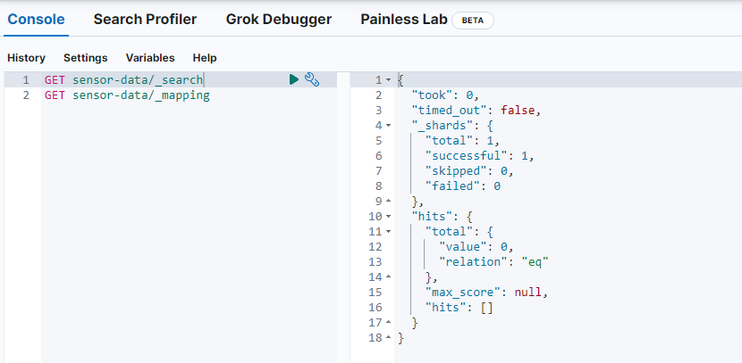
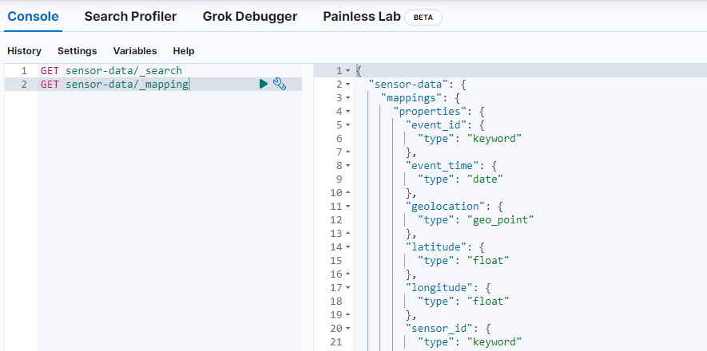
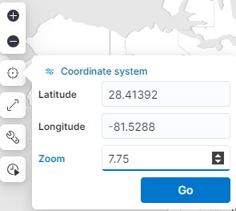
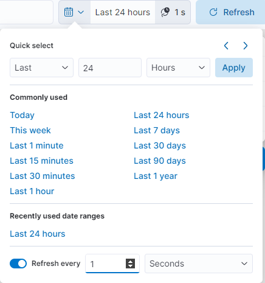

# Structured Streaming Sensors
MQTT > Kafka > Spark > Elasticsearch > Kibana

This demo simulates GPS tracking in a real-time streaming data pipeline.

The data pipeline collects location updates in an MQTT broker. Next, messages are published to Kafka through an MQTT Source Connector. Finally, Spark reads the streaming data from Kafka, processes it, and writes it to Elasticsearch where it is visualized on a Kibana map in real-time.

## Features
- **Streaming Data Processing**: Processes data in real-time using Kafka and Spark Structured Streaming.
- **End-to-End Pipeline**: Integrates MQTT, Kafka, Spark, Elasticsearch, and Kibana.
- **Interactive Visualization**: Displays real-time sensor locations on a Kibana map.
- **GPS Data Generation**: Simulates in-motion GPS sensor data.

## Requirements
- [Python 3.8+](https://www.python.org/downloads/)
- [Docker Compose](https://docs.docker.com/compose/)


## Project Setup

### Set up your Python environment
#### 1. Create a virtual environment
```
python -m venv venv
```
#### 2. Activate the python virtual environment
```
source venv/Scripts/activate
```
#### 3. Install the required packages
```
pip install -r requirements.txt
```

### Bring up all the containers
```
docker-compose up -d
```

---
### Configure the systems
The `config.yml` file contains the global configuration for the project. It include the MQTT broker, Kafka, Kafka Connect, and ElasticSearch configurations. 

Copy and rename `config-example.yml` to `config.yml` and modify the values as needed. If you are standing up the local environment as is, then you will not need to change any of the values.

---
### Deploy the Kafka Connect MQTT source connector
This component is responsible for receiving MQTT messages from the MQTT broker and sending them to Kafka. The JSON file that is deployed to Kafka Connect is `mqtt-source-local.json`, where `<local>` is the name of the environment you want to use - set as the `"global-env"` in the `config.yml` file. The provided `mqtt-source-example.json` file is an example of a Kafka Connect MQTT source connector that you can use as a starting point for custom connector properties.
```
python manage_mqtt_source_connector.py <action>
```
The script takes an action as an argument, which can be one of the following:
- `create`: Creates a Kafka Connect MQTT source connector in the Kafka Connect REST API.
- `delete`: Deletes a Kafka Connect MQTT source connector from the Kafka Connect REST API.

---
### Create the Kafka Topic
The Kafka topic is used to store the sensor data. The topic would automatically be created once messages are sent from the MQTT broker to the Kafka Connect MQTT source connector, however, creating the topic early will prevent issues with Spark not able to find the topic.
```
docker exec kafka kafka-topics --bootstrap-server kafka:29092 --topic sensor-data --create
```

---
### Create the Elastic index, the Kibana data view, and the Kibana map
```
python manage_elastic_schema.py <action>
```
The script takes an action as an argument, which can be one of the following:
- `create`: Creates the Elastic index, data view, and the Kibana map.
- `delete`: Deletes the Elastic index.
- `clear`: Truncates the Elastic index.


To verify the index was created, open the [Kibana UI](http://localhost:5601) and navigate to `Settings` > `Management` > `Dev Tools`. In the console, execute the following commands:
```
GET sensor-data/_search
GET sensor-data/_mapping
```



---
### Update the Kibana map center point, zoom level, and refresh interval
Naviagte to `Settings` > `Analytics` > `Maps` > and open the `Sensor Data Live` map.

On the left side on the map, update the `Latitude`, `Longitude`, and `Zoom` fields. Set the fields as follows:



Just to the right of the search bar, there is a button to set the `Refresh Interval`. Click and set the interval as follows:



---
### Kick off the Spark Appplication
The Spark application is launched via a pyspark Python script that reads data from the Kafka topic and writes it to ElasticSearch. The script uses the Kafka Streams API to read data from the topic and the Elasticsearch maven package to write data to ElasticSearch.

Running this script will start the Spark application and begin processing data from the Kafka topic. It will take some time for the dependencies to be installed, passed in as a `--packages` arguments to spark-submit.
```
docker exec spark-master /opt/bitnami/spark/bin/spark-submit --packages org.apache.spark:spark-sql-kafka-0-10_2.12:3.5.1,org.elasticsearch:elasticsearch-spark-30_2.12:8.14.0 /opt/spark-app/kafka_elastic_streaming_sink.py
```
For more info on the Spark application, see the [Spark Structured Streaming](https://github.com/matt-west/kafka-spark-streaming/blob/main/spark-app/README.md) README.

---
### Generate sensor data
Finally, generate some sensor data to test the application. Run the generator script and open the [Kibana UI](http://localhost:5601) to verify the data is being processed.
```
python start_mqtt_generator.py <*events> <sensors>
```
The `start_mqtt_generator.py` script is used to generate sensor data for the MQTT broker. It takes two arguments: 
- `events`: the number of events to generate.
- `sensors`: the number of sensors to simulate. If left blank, it will default to 1.

For example, to generate 100 events and 10 sensors, you would run the following command:
```
python start_mqtt_generator.py 100 10
```


## Local URLs
- [Confluent Control Center](http://localhost:9021)
- [Spark](http://localhost:8080)
- [Kibana](http://localhost:5601)


## Kafka Console Commands
List Topics
```
docker exec kafkakafka-topics --bootstrap-server kafka:29092 --list
```
Create Topic
```
docker exec kafka kafka-topics --bootstrap-server kafka:29092 --topic sensor-data --create 
```
Kafka Console Producer
```
docker exec -it kafka kafka-console-producer --bootstrap-server kafka:29092 --topic sensor-data
```
Kafka Console Consumer
```
docker exec -it kafka kafka-console-consumer --bootstrap-server kafka:29092 --topic sensor-data
```


## Spark Console Commands
### Kafka Streaming Source
```
docker exec spark-master /opt/bitnami/spark/bin/spark-submit --packages org.apache.spark:spark-sql-kafka-0-10_2.12:3.5.1 /opt/spark-app/kafka_test.py
```

### ElasticSearch Sink
```
docker exec -it spark-master spark-submit --packages org.elasticsearch:elasticsearch-spark-30_2.12:8.14.0 /opt/spark-app/elastic_test.py
```

### And then, both together
```
docker exec spark-master /opt/bitnami/spark/bin/spark-submit --packages org.apache.spark:spark-sql-kafka-0-10_2.12:3.5.1,org.elasticsearch:elasticsearch-spark-30_2.12:8.14.0 /opt/spark-app/kafka_elastic_test.py
```


## Useful Resources
For a list of available endpoints, see the [Kafka Connect REST API documentation](https://docs.confluent.io/current/connect/references/restapi.html).


