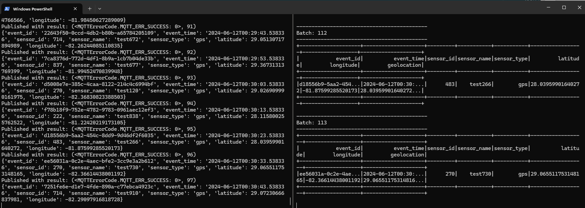
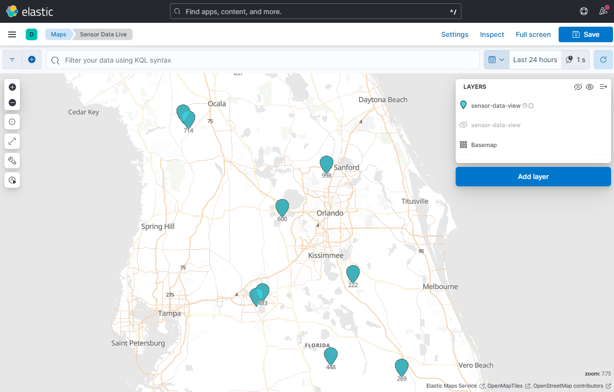

# Kafka Streaming Playground with MQTT and Kafka Connect
This project is a playground for exploring Kafka Streaming and Kafka Connect. It includes a MQTT broker, Kafka Streams, and Kafka Connect.


## Local URLs
- [Kafka Control Center](http://localhost:9021)
- [Spark](http://localhost:8080)
- [Kibana](http://localhost:5601)


## Requirements
- Docker
- python 

## Architecture


## Get Started


### 1. Create a python virtual environment
```
python -m venv venv
```

### 2. Activate the python virtual environment
```
source venv/Scripts/activate
```

### 3. Install the required packages
```
pip install -r requirements.txt
```

### 4. Run the docker-compose file
```
docker-compose up -d
```

### 5. Configure the Project with config.yml
The `config.yml` file contains the global configuration for the project. It include the MQTT broker, Kafka, Kafka Connect, and ElasticSearch configurations. 

Copy and rename `config-example.yml` to `config.yml` and modify the values as needed. If you are standing up the local environment as is, then you will not need to change any of the values.


### 5. Deploy the Kafka Connect MQTT source connector
This component is responsible for receiving MQTT messages from the MQTT broker and sending them to Kafka. The JSON file that is deployed to Kafka Connect is `mqtt-source-local.json`, where `<local>` is the name of the environment you want to use - set as the `"global-env"` in the `config.yml` file. The provided `matt-source-example.json` file is an example of a Kafka Connect MQTT source connector that you can use as a starting point.
```
python manage_mqtt_source_connector.py <action>
```
The script takes an action as an argument, which can be one of the following:
- `create`: Creates a Kafka Connect MQTT source connector in the Kafka Connect REST API server.
- `delete`: Deletes a Kafka Connect MQTT source connector from the Kafka Connect REST API server.


### 6. Create the Kafka Topic
The Kafka topic is used to store the sensor data. The topic would automatically be created once messages are sent from the MQTT broker to the Kafka Connect MQTT source connector, however, creating the topic early will prevent issues with Spark not able to find the topic.
```
docker exec kafka kafka-topics --bootstrap-server kafka:29092 --topic sensor-data --create
```

### 7. Create the Elastic index, the Kibana data view, and the Kibana map
```
python elastic_schema.py <action>
```
The script takes an action as an argument, which can be one of the following:
- `create`: Creates the Elastic index, data view, and the Kibana map.
- `delete`: Deletes the Elastic index.
- `clear`: Truncates the Elastic index.

To verify the index was created, open the Kibana UI and navigate to the Dev Tools tab. In the console, type the following commands:
```
GET sensor-data/_search
GET sensor-data/_mapping
```

### 8. Update the Kibana map center point, zoom level, and refresh interval
28.41392
-81.5288
7.75

Last 24 hours
1 second updates

### 9. Kick off the Spark Appplication
The Spark application is launched via a pyspark Python script that reads data from the Kafka topic and writes it to ElasticSearch. The script uses the Kafka Streams API to read data from the topic and the Elasticsearch maven package to write data to ElasticSearch.

Running this script will start the Spark application and begin processing data from the Kafka topic. It will take some time for the dependencies to be installed, passed in as a `--packages` arguments to spark-submit.
```
docker exec spark-master /opt/bitnami/spark/bin/spark-submit --packages org.apache.spark:spark-sql-kafka-0-10_2.12:3.5.1,org.elasticsearch:elasticsearch-spark-30_2.12:8.14.0 /opt/spark-app/kafka_elastic_streaming_sink.py
```
For more info on the Spark application, see the [Spark Structured Streaming](https://github.com/matt-west/kafka-spark-streaming/blob/main/spark-app/README.md) README.

### 10. Generate sensor data
```
python start_mqtt_generator.py <*events> <sensors>
```
The `start_mqtt_generator.py` script is used to generate sensor data for the MQTT broker. It takes two arguments: 
- `events`: the number of events to generate.
- `sensors`: the number of sensors to simulate. If left blank, it will default to 1.

For example, to generate 100 events and 10 sensors, you would run the following command:
```
python start_mqtt_generator.py 100 10
```






## Docker
Start Docker Services:
docker-compose up -d


## MQTT connector
Open `mqqt_source_connector.py` and change the `env` variable to the name of the environment you want to use.
Invoke-WebRequest -Uri "http://localhost:8083/connectors" -Method POST -Headers @{"Content-Type"="application/json"} -InFile "./mqtt-source-local.json" -UseBasicParsing
curl -X POST -H "Content-Type: application/json" --data @mqtt-source-connector.json http://localhost:8083/connectors

## Schema Registry
https://docs.confluent.io/platform/current/schema-registry/develop/api.html

Invoke-WebRequest -Uri "http://localhost:8081/subjects/sensors/versions" -Method POST -Headers @{"Content-Type"="application/vnd.schemaregistry.v1+json"} -InFile "./kafka-schema/sensor-data.json" -UseBasicParsing

## Kafka
docker exec kafka kafka-topics --bootstrap-server kafka:29092 --topic sensor-data --create 

docker exec -it kafka kafka-console-producer --bootstrap-server kafka:29092 --topic sensor-data

docker exec -it kafka kafka-console-consumer --bootstrap-server kafka:29092 --topic sensor-data

## Confluent Control Center
http://localhost:9021

## Spark
http://localhost:8080
docker exec spark-master /opt/bitnami/spark/bin/spark-submit --packages org.apache.spark:spark-sql-kafka-0-10_2.12:3.5.1 /opt/spark-app/kafka_test.py

docker exec spark-master /opt/bitnami/spark/bin/spark-submit --packages org.apache.spark:spark-sql-kafka-0-10_2.12:3.5.1 /opt/spark-app/kafka_clickhouse_test.py

docker exec -it spark-master spark-submit --packages org.apache.spark:spark-sql-kafka-0-10_2.12:3.5.1 --jars /opt/spark/jars/clickhouse-jdbc-0.6.0-patch5-all.jar /opt/spark-app/kafka_clickhouse_test.py

docker exec -it spark-master spark-submit --packages org.apache.spark:spark-sql-kafka-0-10_2.12:3.5.1,com.github.housepower:clickhouse-spark-runtime-3.5.1_2.12:0.6.0 /opt/spark-app/kafka_clickhouse_test.py


com.github.housepower:clickhouse-spark-runtime-3.5.1_2.12:0.6.0


docker exec -it spark-master spark-submit --packages org.elasticsearch:elasticsearch-spark-20_2.12:7.10.0 /opt/spark-app/elastic_test.py

org.elasticsearch:elasticsearch-spark_2.11:jar:2.4.5
org.elasticsearch:elasticsearch-spark-20_2.12:7.10.0
org.elasticsearch:elasticsearch-hadoop:8.4.0

### This is the one that works!!!

### Kafka Streaming Source
docker exec spark-master /opt/bitnami/spark/bin/spark-submit --packages org.apache.spark:spark-sql-kafka-0-10_2.12:3.5.1 /opt/spark-app/kafka_test.py

### ElasticSearch Sink
docker exec -it spark-master spark-submit --packages org.elasticsearch:elasticsearch-spark-30_2.12:8.14.0 /opt/spark-app/elastic_test.py

### And then, together with the Kafka Streaming Source
docker exec spark-master /opt/bitnami/spark/bin/spark-submit --packages org.apache.spark:spark-sql-kafka-0-10_2.12:3.5.1,org.elasticsearch:elasticsearch-spark-30_2.12:8.14.0 /opt/spark-app/kafka_elastic_test.py


Establish a connection to the Kafka broker:
```docker exec -it kafka /bin/bash```


## Kafka Useful Commands

List Topics
```
kafka-topics --bootstrap-server <broker_name:port> --list
```
Create Topic
```
kafka-topics --create --topic <topic_name> --bootstrap-server <broker_name:port>
```
Kafka Consumer
```
kafka-console-consumer --topic <topic_name> --from-beginning --bootstrap-server <broker_name:port>
```
Kafka Producer
```
kafka-console-producer --topic <topic_name> --bootstrap-server <broker_name:port>
```


## Kafka Connect
Kafka Connect is a tool for building and managing data integration and delivery pipelines. It is a component of the Kafka ecosystem and is used to connect Kafka with external systems and services.

### Kafka Connect REST API
The Kafka Connect REST API is a set of HTTP endpoints that allow you to manage and configure Kafka Connect connectors and tasks. It provides a way to interact with Kafka Connect programmatically and automate the deployment and management of data integration and delivery pipelines.

You will need to use this API to create and manage connectors, tasks, and other resources in Kafka Connect.

To get the most out of this project, you will want to have an MQTT broker running on your local machine. You can use a free broker like Mosquitto or install one on your own server. 
Get a list of all connectors:

#rewrite the following lines of code for unix vs windows
curl -X GET http://localhost:8083/connectors
and on windows:
Invoke-WebRequest -Uri "http://localhost:8083/connectors" -Method GET
Get a list of all connectors:


For a list of available endpoints, see the [Kafka Connect REST API documentation](https://docs.confluent.io/current/connect/references/restapi.html).


curl -X GET http://localhost:8083/connectors

Invoke-WebRequest -Uri "http://localhost:8083/connectors" -Method GET

Invoke-WebRequest -Uri "http://localhost:8083/connectors/source-mqtt" -Method Delete

Invoke-WebRequest -Uri "http://localhost:8083/connectors" -Method POST -Headers @{"Content-Type"="application/json"} -InFile "D:\Dev\cl_repo\kafka-spark-streaming\mqtt\mqtt-source-local.json" -UseBasicParsing

Invoke-WebRequest -Uri "http://localhost:8083/connectors" -Method POST `
-Headers @{"Content-Type"="application/json"} -InFile "D:\Dev\cl_repo\kafka\mqtt-remote.json" -UseBasicParsing

kafka-console-consumer --bootstrap-server kafka:29092 --topic test


